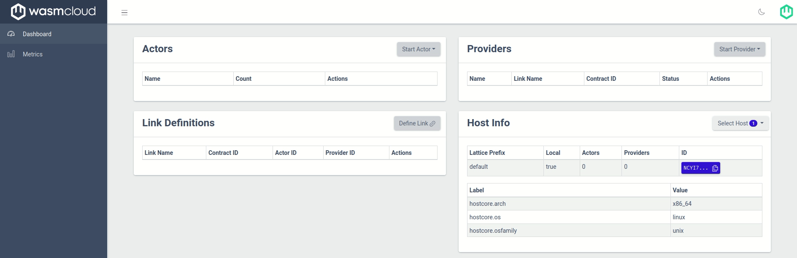
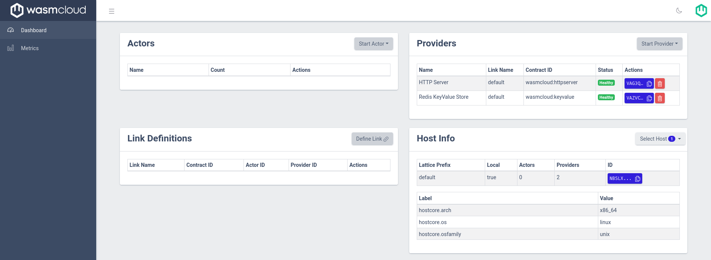
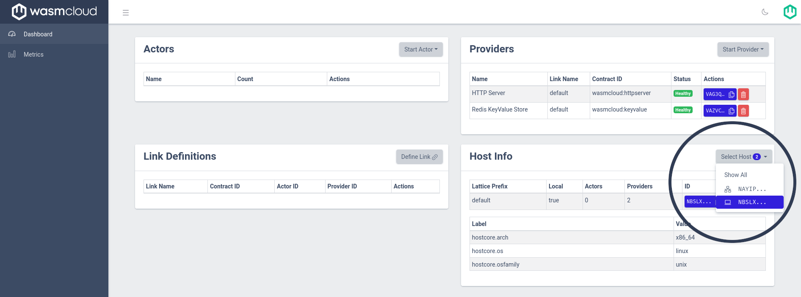
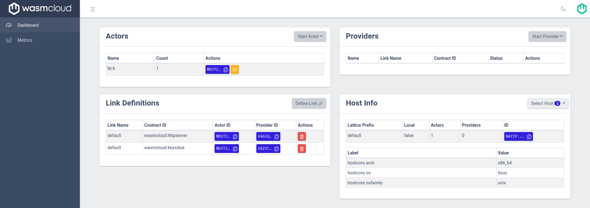

# `kvcounter` - WASMCon 2023

Building on the [previous version of `kvcounter`][legacy-kvcounter], this actor is an example of [WIT][wit]-powered functionality in an actor that runs on a wasmCloud lattice.

Specifically, this actor:

- Uses [`wit-deps`][wit-deps] to manage WIT file dependencies
- Uses the [`wasi-keyvalue` contract][wasi-keyvalue]
- Uses a slightly modified fork of the [`wasi-http` WIT contract][wasmcloud-wasi-http]
  - In particular, we use the [`wasi:http/incoming-handler` interface][wamscloud-wasi-http-incoming-handler]

In additional to all the cutting edge functionality above, this `kvcounter` also does the legacy `kvcounter` things:

- Uses the [`wasmcloud:httpserver` interface][iface-httpserver] to:
  - Serve a static frontend embedded in the WASM component with [`rust-embed`][rust-embed]
  - Accept HTTP GET requests as commands to increment a counter based on the URL path
- Uses the [`wasmcloud:keyvalue` interface][iface-keyvalue] to communicate with a capability provider (ex [kvredis][kvredis] or [kv-vault][kvvault]) to manipulate KV data
- Shows the updated values to the user via the UI

[legacy-kvcounter]: ../kvcounter
[wit-deps]: https://github.com/bytecodealliance/wit-deps
[wasmcloud-wasi-http]: https://github.com/wasmCloud/wasi-http
[wasmcloud-wasi-http-incoming-handler]: https://github.com/wasmCloud/wasi-http/blob/main/wit/incoming-handler.wit
[redis]: https://redis.io
[vault]: https://www.hashicorp.com/products/vault
[iface-httpserver]: https://github.com/wasmCloud/interfaces/tree/main/httpserver
[iface-keyvalue]: https://github.com/wasmCloud/interfaces/tree/main/keyvalue
[kvredis]: https://github.com/wasmCloud/capability-providers/tree/main/kvredis
[kvvault]: https://github.com/wasmCloud/capability-providers/tree/main/kv-vault
[rust-embed]: https://crates.io/crates/rust-embed
[wasi-keyvalue]: https://github.com/WebAssembly/wasi-keyvalue
[wit]: https://github.com/WebAssembly/component-model/blob/main/design/mvp/WIT.md

## Dependencies

The code in this project depends on the following dependencies:

- [`wash`][wash] (>= [v0.20.0][wash-v0.20.0])
- [`just`][just]

[just]: https://github.com/casey/just
[wash]: https://github.com/wasmCloud/wash
[wash-v0.20.0]: https://github.com/wasmCloud/wash/releases/tag/v0.20.0

## How to build

Before building, make sure to confirm that your `wasmcloud.toml` matches what is expected;

```toml
name = "KVCounter"
language = "rust"
type = "actor"

[actor]
claims = ["wasmcloud:httpserver", "wasmcloud:keyvalue"]
wasm_target = "wasm32-wasi-preview2"
```

Building is as easy as running `wash build`:

```console
wash build
```

After building, you should have a `build` directory locally with the following contents:

```
➜ tree build
build
├── wasmcon2023_keyvalue_s.wasm
└── wasmcon2023_keyvalue.wasm
```

`wasmcon2023_keyvalue_s.wasm` is your [built & signed actor][docs-actor-identity], ready to be run on a wasmCloud lattice.

[docs-actor-identity]: https://wasmcloud.com/docs/hosts/security#actor-identity

## How to run

Here's how to run this wasmCloud and this actor specifically with all bells and whistles.

### 1. Run `wash up`

Run `wash up` to start the [Elixir + Rust host (AKA `wasmcloud-otp`)][wasmcloud-otp]

Take a note of the `WASMCLOUD_CLUSTER_SEED` value and the `WASMCLOUD_CLUSTER_ISSUERS` in the text printed to the console after startup. For example:

```
➜ wash up
🏃 Running in interactive mode, your host is running at http://localhost:4000
🚪 Press `CTRL+c` at any time to exit
21:34:40.439 [info] Loading 144 CA(s) from :otp store
21:34:41.554 [info] Wrote configuration file /path/to/.wash/host_config.json
21:34:41.554 [info] Configured host logs at level 'info'
21:34:41.605 [info] lattice_prefix=default Starting lattice supervisor for 'default'
21:34:41.608 [info] lattice_prefix=default Will connect to control interface NATS without authentication
21:34:41.610 [info] lattice_prefix=default Will connect to lattice rpc NATS without authentication
21:34:41.625 [info] Lattice supervisor default started.
21:34:41.629 [info] Virtual Host NC5F7P5QTOE5EG66XLVWJSJ5GS7D6EWOCDYZQ3ZWMBBVMUVDHWIOU4Z5 (red-lake-9998) started.
21:34:41.629 [info] Virtual Host Issuer Public key: CC5N7KO23PCE44EFGUAJCUA372OBVVWRHSYTKDXK4HBKHC3SPO7SPQSO
21:34:41.633 [info] Valid cluster signers for host: CC5N7KO23PCE44EFGUAJCUA372OBVVWRHSYTKDXK4HBKHC3SPO7SPQSO
21:34:41.633 [warning] WARNING. You are using an ad hoc generated cluster seed.
For any other host or CLI tool to communicate with this host,
you MUST copy the following seed key and use it as the value
of the WASMCLOUD_CLUSTER_SEED environment variable:

SCAONKI3YO6JXLNNOFFLXIECOICWOIBHUCJBZOMIDB2IR3MUOTM5W6VZPA

You must also ensure the following cluster signer is in the list of valid
signers for any new host you start:

CC5N7KO23PCE44EFGUAJCUA372OBVVWRHSYTKDXK4HBKHC3SPO7SPQSO


21:34:41.643 [info] Started wasmCloud internal wasm runtime v0.1.0
21:34:41.649 [info] version=0.63.1 Started wasmCloud OTP Host Runtime
```

After wash up is completed, you should be able to open up the Washboard @ [http://localhost:4000](http://localhost:4000):


Note that you only have *one* host running at this point:



[wasmcloud-otp]: https://github.com/wasmCloud/wasmcloud-otp

### 2. Start the providers you'd like to use

For this example, we'll need to use *two* providers (`httpserver` and `kvredis`/`kv-vault`).

You can start the `httpserver` provider (which responds to the [`wasmcloud:httpserver` interface][iface-httpserver]) by adding a provider via OCI reference `wasmcloud.azurecr.io/httpserver:0.17.0`:


Since we'll want to use `kvredis`, before starting the provider, you can start a redis instance simply by running an instance of Redis via `docker` (or native `redis-server`):

```console
docker run --rm -p 6379:6379 redis:7.2.0-alpine3.18@sha256:5ddcd6e1a1ee0d3a2e9fe1abb427be987ab082e4756bdc513cd4293dacf05d27
```

Now that a `redis` instance is started, you can start the `kvredis` capability provider (which responds to the [`wasmcloud:keyvalue` interface][iface-keyvalue]) by adding a provider via OCI reference `wasmcloud.azurecr.io/kvredis:0.22.0`:


Once you have both providers running, your washboard should look like the following:



### 3. Start the Rust Host

To start the new [🦀 wasmCloud Rust Host][rust-host], once you have built it locally:

```console
export WASMCLOUD_CLUSTER_SEED=SCAONKI3YO6JXLNNOFFLXIECOICWOIBHUCJBZOMIDB2IR3MUOTM5W6VZPA;  # see the logs above
export WASMCLOUD_CLUSTER_ISSUERS=CC5N7KO23PCE44EFGUAJCUA372OBVVWRHSYTKDXK4HBKHC3SPO7SPQSO; # see the logs above
wasmcloud --allow-file-load # start the Rust host
```

After starting the Rust host, you should be able to confirm it's existence in the Washboard:



> **Note**
> Note that your values for `WASMCLOUD_CLUSTER_SEED`, `WASMCLOUD_CLUSTER_ISSUERS` and host names will differ!

Take a note note of the Host ID of the new host displayed in the washboard (click the purple button to copy it to your clipboard!).

For example, a host ID will look something like this:

```
NA6MVT7BKROKWOUXFEAXM6DZQACFBO26VIYA6B2JAHM6POH6ZKIUYUX6
```

### 4. Start `kvcounter`

To start `kvcounter` on the Rust host in particular, we can use `wash`:

```console
wash start actor file:///path/to/your/build/wasmcon2023_keyvalue_s.wasm --host <YOUR HOST ID>
```

Your output should look something like the following:

```
Actor [MD3T2JMVXPP2DNY3YGVIXOFHPSCOUQOE4IFOLC4EKDB3QFOTWQPHACAH] (ref: [file:///home/mrman/code/work/cosmonic/forks/examples/actor/kvcounter-wasmcon2023/build/wasmcon2023_keyvalue_s.wasm]) started on host [NAYIPQDLQE62R3XEICJZXJEOCUASMA5BC24O76H3ONVIJS7ONTNBWQYI]
```

Take a note of the Actor ID for your actor. For example it should look something like this:

```
MD3T2JMVXPP2DNY3YGVIXOFHPSCOUQOE4IFOLC4EKDB3QFOTWQPHACAH
```

> **Note**
> You can also use the `just run-actor <host-id>` target, like so:
>
> ```console
> just run-actor NAYIPQDLQE62R3XEICJZXJEOCUASMA5BC24O76H3ONVIJS7ONTNBWQYI
> ```

### 5. Link the Providers to your `kvcounter`

To link the capability providers we've already started to `kvcounter`, create some links:

```console
# NOTE: the IDs starting with "VA" here *do not* change, but you must fill in your actor ID!
wash link put <YOUR ACTOR ID> VAG3QITQQ2ODAOWB5TTQSDJ53XK3SHBEIFNK4AYJ5RKAX2UNSCAPHA5M wasmcloud:httpserver
wash link put <YOUR ACTOR ID> VAZVC4RX54J2NVCMCW7BPCAHGGG5XZXDBXFUMDUXGESTMQEJLC3YVZWB wasmcloud:keyvalue
```

> **Note**
> You can also use the `just run-actor <host-id>` target, like so:
>
> ```console
> just setup-links NAYIPQDLQE62R3XEICJZXJEOCUASMA5BC24O76H3ONVIJS7ONTNBWQYI
> ```

Your output should look something like the following (one for each `wash link put`):

```
Published link (MD3T2JMVXPP2DNY3YGVIXOFHPSCOUQOE4IFOLC4EKDB3QFOTWQPHACAH) <-> (VAG3QITQQ2ODAOWB5TTQSDJ53XK3SHBEIFNK4AYJ5RKAX2UNSCAPHA5M) successfully

Published link (MD3T2JMVXPP2DNY3YGVIXOFHPSCOUQOE4IFOLC4EKDB3QFOTWQPHACAH) <-> (VAZVC4RX54J2NVCMCW7BPCAHGGG5XZXDBXFUMDUXGESTMQEJLC3YVZWB) successfully
```

Once you've created these links you should be able to confirm them with the Washboard:



Since we have the Rust host selected `NAY...`, we only see the actor and links, and not the two providers we started, which are *still running*. Links are visible to the entire lattice.

### 6. Visit the kvcounter demo

All the setup is done! Now you can visit your kvcounter demo at [http://localhost:8000](http://localhost:8000):


🎉 Congratulations, you've just run a WIT-enabled component that interacts with HTTP and Redis!

## Optional: Confirm changes in the Redis instance

To confirm that your upstream Redis instance has been updated, list the keys you've incremented:

```
➜ redis-cli KEYS '*'
1) "default"
2) "new-bucket"
```

> **Note**
> By default, `redis-cli` will connect to `localhost:6379` which *should* point to the redis instance you started earlier

Then, you get the values in any of the keys your stored:

```console
➜ redis-cli GET 'default'
"25"
➜ redis-cli GET 'new-bucket'
"15"
```

[rust-host]: https://github.com/wasmCloud/wasmcloud
